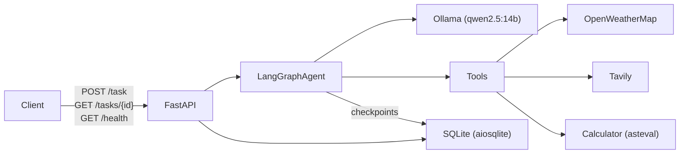

# tufin-ai-agent

Multi-tool agent with async SQLite persistence.

## Architecture Overview

### High-level system diagram



### API Endpoints

The FastAPI layer exposes three endpoints (defined in `app/main.py`):

- **`GET /health`** -- Returns service status and version. No side effects.
- **`POST /task`** -- Accepts a `TaskRequest` (`input` string, optional `conversation_id`). Creates or resumes a conversation, runs the agent graph, persists the result, and returns a `TaskResponse` with `task_id`, `conversation_id`, `final_answer`, and execution `trace`.
- **`GET /tasks/{task_id}`** -- Retrieves a stored task record by ID, including status (`pending` / `completed` / `failed`), token usage, latency, and the full trace of reasoning and tool-call steps.

### Agent reasoning loop


### Components

- **FastAPI layer** (`app/main.py`) -- HTTP endpoints and lifespan startup (database initialization, agent graph compilation).
- **Agent graph** (`app/agent/`) -- LangGraph `StateGraph` with three nodes: `reasoning_node`, `tools_executer_node`, and `max_iterations_answer_node`. Conditional routing directs the flow based on whether the LLM issued tool calls and whether the iteration limit has been reached.
- **LLM** (`app/agent/llm.py`) -- `ChatOllama` from `langchain-ollama`, with tool binding for the registered tools.
- **Tools** (`app/tools/`) -- Three LangChain `@tool` functions: `calculate` (math via asteval), `get_weather` (OpenWeatherMap API), and `search_web` (Tavily API).
- **Database** (`app/database.py`) -- Async SQLite via aiosqlite for conversations, tasks, and trace steps. The same database file also holds LangGraph checkpoint tables for conversation memory.
- **Config** (`app/config.py`) -- `pydantic-settings` `Settings` class loaded from `.env`.


## Setup and Run

### Prerequisites

- [Docker](https://docs.docker.com/get-docker/) and [Docker Compose](https://docs.docker.com/compose/) installed
- A `.env` file in the project root (copy from `.env.example` and fill in your API keys)

```bash
cp .env.example .env
# Edit .env and add your TAVILY_API_KEY, OPENWEATHER_API_KEY, etc.
```

### Docker Desktop memory requirement

`qwen2.5:14b` requires ~8.7 GB of RAM. Before starting, ensure Docker Desktop is allocated enough memory:

1. Open **Docker Desktop** → **Settings** (gear icon) → **Resources** → **Advanced**
2. Set **Memory** to at least **12 GB** (GPU is recommended)
3. Click **Apply & Restart**

### Running with Docker Compose (recommended)

```bash
docker compose up --build
```

This starts two services:

- **`ollama`** — serves the `qwen2.5:14b` model (downloaded automatically on first run, ~9 GB)
- **`app`** — FastAPI server available at [http://localhost:8000](http://localhost:8000)

The `app` service waits for Ollama to finish pulling the model before starting. First boot may take several minutes.

> **Data persistence**: SQLite data is stored in a named Docker volume (`agent_data`) and survives restarts. Ollama model weights are cached in `ollama_data` so they are not re-downloaded on subsequent starts.

To run in the background:

```bash
docker compose up --build -d
```

To stop:

```bash
docker compose down
```

To stop and remove all volumes (wipes DB and cached model):

```bash
docker compose down -v
```

### Running locally (without Docker)

Requires Python 3.12+ and [`uv`](https://github.com/astral-sh/uv), and a locally running [Ollama](https://ollama.com/) instance with `qwen2.5:14b` pulled:

```bash
ollama pull qwen2.5:14b
```

Install dependencies and start the server:

```bash
uv sync
uv run uvicorn app.main:app --reload
```

The API will be available at [http://localhost:8000](http://localhost:8000).

### API Endpoints

All examples below assume the app is running via Docker Compose and accessible at `http://localhost:8000`.

---

#### `GET /health`

Check that the service is up.

```bash
curl http://localhost:8000/health
```

Response:

```json
{
  "status": "ok",
  "version": "0.1.0"
}
```

---

#### `POST /task` — Submit a new task

Send a natural language task to the agent. A new conversation is started automatically.

```bash
curl -X POST http://localhost:8000/task \
  -H "Content-Type: application/json" \
  -d '{"input": "What is the weather in Tel Aviv?"}'
```

Response:

```json
{
  "task_id": "e3b0c442-...",
  "conversation_id": "a1b2c3d4-...",
  "final_answer": "The current weather in Tel Aviv is ...",
  "trace": [
    {
      "step_index": 0,
      "type": "llm reasoning",
      "description": "..."
    },
    {
      "step_index": 1,
      "type": "tool call",
      "tool_name": "weather",
      "tool_input": {"city": "Tel Aviv"},
      "tool_output": {"temperature": 28, "description": "Clear sky"}
    },
    {
      "step_index": 2,
      "type": "answer generation",
      "description": "..."
    }
  ]
}
```

#### `POST /task` — Continue a conversation (multi-turn)

Pass the `conversation_id` from a previous response to continue the same thread. The agent retains full message history via the LangGraph checkpointer.

```bash
curl -X POST http://localhost:8000/task \
  -H "Content-Type: application/json" \
  -d '{
    "input": "And what about tomorrow?",
    "conversation_id": "a1b2c3d4-..."
  }'
```

---

#### `GET /tasks/{task_id}` — Retrieve a task

Fetch a stored task record by its ID, including status, metrics, and full trace.

```bash
curl http://localhost:8000/tasks/e3b0c442-...
```

Response:

```json
{
  "task_id": "e3b0c442-...",
  "conversation_id": "a1b2c3d4-...",
  "input": "What is the weather in Tel Aviv?",
  "final_answer": "The current weather in Tel Aviv is ...",
  "status": "completed",
  "token_usage": 312,
  "latency_ms": 4821,
  "created_at": "2026-04-11T10:00:00",
  "trace": [...]
}
```

Possible `status` values: `pending`, `completed`, `failed`.

---

#### Interactive docs (Swagger UI)

FastAPI auto-generates interactive API documentation available at:

- Swagger UI: [http://localhost:8000/docs](http://localhost:8000/docs)
- ReDoc: [http://localhost:8000/redoc](http://localhost:8000/redoc)

---

