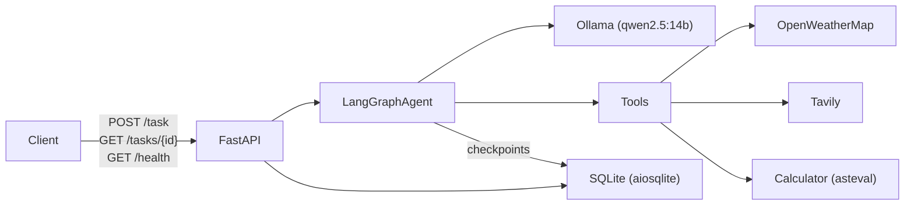
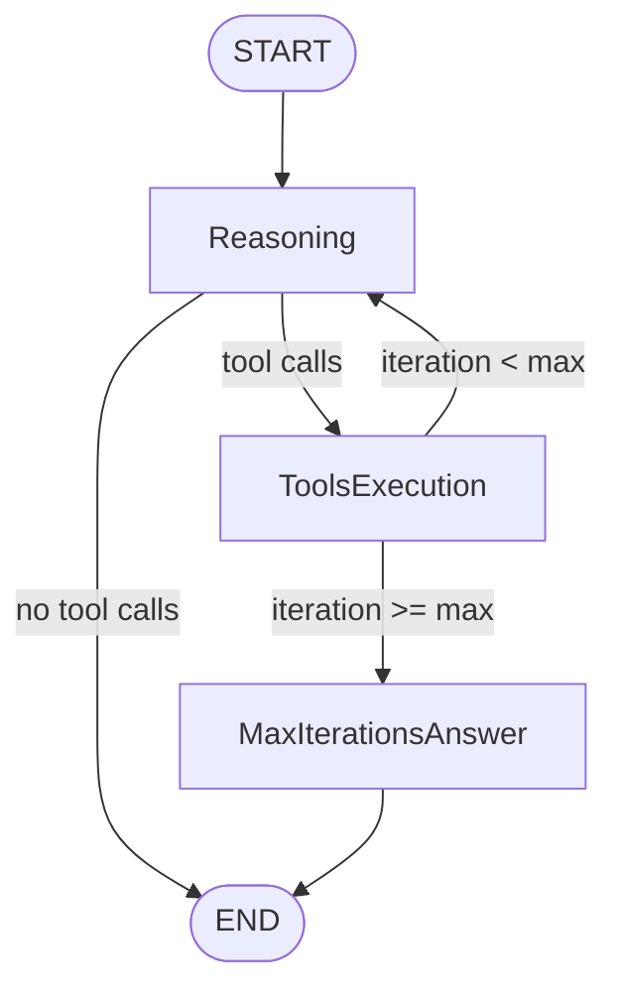

# tufin-ai-agent

Multi-tool agent with async SQLite persistence.

## Architecture Overview

### High-level system diagram



### API Endpoints

The FastAPI layer exposes three endpoints (defined in `app/main.py`):

- **`GET /health`** -- Returns service status and version. No side effects.
- **`POST /task`** -- Accepts a `TaskRequest` (`input` string, optional `conversation_id`). Creates or resumes a conversation, runs the agent graph, persists the result, and returns a `TaskResponse` with `task_id`, `conversation_id`, `final_answer`, and execution `trace`.
- **`GET /tasks/{task_id}`** -- Retrieves a stored task record by ID, including status (`pending` / `completed` / `failed`), token usage, latency, and the full trace of reasoning and tool-call steps.

### Agent reasoning loop



### Components

- **FastAPI layer** (`app/main.py`) -- HTTP endpoints and lifespan startup (database initialization, agent graph compilation).
- **Agent graph** (`app/agent/`) -- LangGraph `StateGraph` with three nodes: `reasoning_node`, `tools_executer_node`, and `max_iterations_answer_node`. Conditional routing directs the flow based on whether the LLM issued tool calls and whether the iteration limit has been reached.
- **LLM** (`app/agent/llm.py`) -- `ChatOllama` from `langchain-ollama`, with tool binding for the registered tools.
- **Tools** (`app/tools/`) -- Three LangChain `@tool` functions: `calculate` (math via asteval), `get_weather` (OpenWeatherMap API), and `search_web` (Tavily API).
- **Database** (`app/database.py`) -- Async SQLite via aiosqlite for conversations, tasks, and trace steps. The same database file also holds LangGraph checkpoint tables for conversation memory.
- **Config** (`app/config.py`) -- `pydantic-settings` `Settings` class loaded from `.env`.


## Setup and Running instructions

### Prerequisites

- [Docker](https://docs.docker.com/get-docker/) and [Docker Compose](https://docs.docker.com/compose/) installed
- A `.env` file in the project root (copy from `.env.example` and fill in your API keys)

```bash
cp .env.example .env
# Edit .env and add your TAVILY_API_KEY, OPENWEATHER_API_KEY, etc.
```

### Docker Desktop memory requirement

`qwen2.5:14b` requires ~8.7 GB of RAM. Before starting, ensure Docker Desktop is allocated enough memory:

1. Open **Docker Desktop** → **Settings** (gear icon) → **Resources** → **Advanced**
2. Set **Memory** to at least **12 GB** (GPU is recommended)
3. Click **Apply & Restart**

### Running with Docker Compose, from project directory:

```bash
docker compose up --build
```

This starts two services:

- **`ollama`** — serves the `qwen2.5:14b` model (downloaded automatically on first run, ~9 GB)
- **`app`** — FastAPI server available at [http://localhost:8000](http://localhost:8000)

The `app` service waits for Ollama to finish pulling the model before starting. First boot may take several minutes.

> **Data persistence**: SQLite data is stored in a named Docker volume (`agent_data`) and survives restarts. Ollama model weights are cached in `ollama_data` so they are not re-downloaded on subsequent starts.

To run in the background:

```bash
docker compose up --build -d
```

To stop:

```bash
docker compose down
```

To stop and remove all volumes (wipes DB and cached model):

```bash
docker compose down -v
```

### How to run each API:

##### `GET /health`

Check that the service is up.

```bash
curl http://localhost:8000/health
```

Response:

```json
{
  "status": "ok",
  "version": "0.1.0"
}
```

---

##### `POST /task` — Submit a new task

Send a natural language task to the agent. A new conversation is started automatically.

```bash
curl -X POST http://localhost:8000/task \
  -H "Content-Type: application/json" \
  -d '{"input": "What is the weather in Tel Aviv?"}'
```

Response:

```json
{
  "task_id": "e3b0c442-...",
  "conversation_id": "a1b2c3d4-...",
  "final_answer": "The current weather in Tel Aviv is ...",
  "trace": [
    {
      "step_index": 0,
      "type": "llm reasoning",
      "description": "..."
    },
    {
      "step_index": 1,
      "type": "tool call",
      "tool_name": "weather",
      "tool_input": {"city": "Tel Aviv"},
      "tool_output": {"temperature": 28, "description": "Clear sky"}
    },
    {
      "step_index": 2,
      "type": "answer generation",
      "description": "..."
    }
  ]
}
```

##### `POST /task` — Continue a conversation (multi-turn)

Pass the `conversation_id` from a previous response to continue the same thread. The agent retains full message history via the LangGraph checkpointer.

```bash
curl -X POST http://localhost:8000/task \
  -H "Content-Type: application/json" \
  -d '{
    "input": "And what about tomorrow?",
    "conversation_id": "a1b2c3d4-..."
  }'
```

---

##### `GET /tasks/{task_id}` — Retrieve a task

Fetch a stored task record by its ID, including status, metrics, and full trace.

```bash
curl http://localhost:8000/tasks/e3b0c442-...
```

Response:

```json
{
  "task_id": "e3b0c442-...",
  "conversation_id": "a1b2c3d4-...",
  "input": "What is the weather in Tel Aviv?",
  "final_answer": "The current weather in Tel Aviv is ...",
  "status": "completed",
  "token_usage": 312,
  "latency_ms": 4821,
  "created_at": "2026-04-11T10:00:00",
  "trace": [...]
}
```

Possible `status` values: `pending`, `completed`, `failed`.

### Running locally (without Docker)

Requires Python 3.12+ and [`uv`](https://github.com/astral-sh/uv), and a locally running [Ollama](https://ollama.com/) instance with `qwen2.5:14b` pulled:

```bash
ollama pull qwen2.5:14b
```

Install dependencies and start the server:

```bash
uv sync
uv run uvicorn app.main:app --reload
```

The API will be available at [http://localhost:8000](http://localhost:8000).

### API Endpoints

All examples below assume the app is running via Docker Compose and accessible at `http://localhost:8000`.


---

#### Interactive docs (Swagger UI)

FastAPI auto-generates interactive API documentation available at:

- Swagger UI: [http://localhost:8000/docs](http://localhost:8000/docs)
- ReDoc: [http://localhost:8000/redoc](http://localhost:8000/redoc)

---

## 5 Task Examples with Their Output and Traces

---

### 1. Math — Square root calculation

**Question:** What is the square root of 1764 multiplied by 42?

**Final answer:** The square root of 1764 is 42, so when you multiply it by 42, the result is 1764.0.

```bash
curl -X POST http://localhost:8000/task \
  -H "Content-Type: application/json" \
  -d '{"input": "What is the square root of 1764 multiplied by 42?"}'
```

**Response:**

```json
{
  "task_id": "55fd6852-d14f-468a-8398-c522d265f00a",
  "conversation_id": "43e6bb45-0cad-4abe-9045-f9185943454d",
  "final_answer": "The square root of 1764 is 42, so when you multiply it by 42, the result is 1764.0.",
  "trace": [
    {
      "step_index": 0,
      "type": "llm reasoning",
      "description": "Model decided to call tools: calculate"
    },
    {
      "step_index": 1,
      "type": "tool call",
      "description": "Executed calculate. See trace for details.",
      "tool_name": "calculate",
      "tool_input": {"expression": "sqrt(1764) * 42"},
      "tool_output": {"result": 1764.0}
    },
    {
      "step_index": 2,
      "type": "llm reasoning",
      "description": "Generating final answer — sufficient information gathered"
    }
  ]
}
```

---

### 2. Web search — Latest AI model releases

**Question:** What are the latest AI model releases in 2025?

**Final answer:** In 2025, several notable AI model releases occurred: Alibaba released Qwen 2.5-Max, which claims superior performance compared to GPT-4o. Other large language model (LLM) releases included GPT-5, Claude 4, and Gemini 2. By 2026, benchmarks for these models were established.

```bash
curl -X POST http://localhost:8000/task \
  -H "Content-Type: application/json" \
  -d '{"input": "What are the latest AI model releases in 2025?"}'
```

**Response:**

```json
{
  "task_id": "dbd9c54e-aed1-4707-b455-0d5b520d664b",
  "conversation_id": "bac52bd9-4e1e-4d68-a1f6-ff82a7906b6c",
  "final_answer": "In 2025, several notable AI model releases occurred:\n\n- Alibaba released Qwen 2.5-Max, which claims superior performance compared to GPT-4o.\n- Other large language model (LLM) releases included GPT-5, Claude 4, and Gemini 2.\n\nBy 2026, benchmarks for these models were established.",
  "trace": [
    {
      "step_index": 0,
      "type": "llm reasoning",
      "description": "Model decided to call tools: search_web"
    },
    {
      "step_index": 1,
      "type": "tool call",
      "description": "Executed search_web. See trace for details.",
      "tool_name": "search_web",
      "tool_input": {"max_results": 3, "query": "latest AI model releases 2025"},
      "tool_output": {"summary": "In 2025, Alibaba released Qwen 2.5-Max, claiming superior performance over GPT-4o. LLM releases included GPT-5, Claude 4, and Gemini 2. By 2026, benchmarks for these models were established."}
    },
    {
      "step_index": 2,
      "type": "llm reasoning",
      "description": "Generating final answer — sufficient information gathered"
    }
  ]
}
```

---

### 3. Weather — Single city lookup

**Question:** What is the weather in Tel Aviv?

**Final answer:** The current weather in Tel Aviv is as follows: The temperature is 16.06°C, it feels like 15.65°C due to the humidity of 74%. There are few clouds in the sky and the wind speed is 2.06 m/s.

```bash
curl -X POST http://localhost:8000/task \
  -H "Content-Type: application/json" \
  -d '{"input": "What is the weather in Tel Aviv?"}'
```

**Response:**

```json
{
  "task_id": "b249ffd5-cf65-4629-9f84-728943a541a4",
  "conversation_id": "5ca5226b-3aa0-43b9-af71-68cccfc53b18",
  "final_answer": "The current weather in Tel Aviv is as follows: The temperature is 16.06°C, it feels like 15.65°C due to the humidity of 74%. There are few clouds in the sky and the wind speed is 2.06 m/s.",
  "trace": [
    {
      "step_index": 0,
      "type": "llm reasoning",
      "description": "Model decided to call tools: get_weather"
    },
    {
      "step_index": 1,
      "type": "tool call",
      "description": "Executed get_weather. See trace for details.",
      "tool_name": "get_weather",
      "tool_input": {"city": "Tel Aviv"},
      "tool_output": {
        "city": "Tel Aviv",
        "country": "IL",
        "temperature_celsius": 16.06,
        "feels_like_celsius": 15.65,
        "humidity_percent": 74,
        "description": "few clouds",
        "wind_speed_ms": 2.06
      }
    },
    {
      "step_index": 2,
      "type": "llm reasoning",
      "description": "Generating final answer — sufficient information gathered"
    }
  ]
}
```

---

### 4. Multi-tool — Web search + Weather (chained)

**Question:** What is the weather in the second most populated city of Guatemala?

**Final answer:** The current weather in Quetzaltenango, Guatemala is as follows: Temperature: 20.75°C, Feels like: 20.37°C, Humidity: 57%, Description: Scattered clouds, Wind speed: 1.34 m/s.

```bash
curl -X POST http://localhost:8000/task \
  -H "Content-Type: application/json" \
  -d '{"input": "what is the weather in the second most populated city of guatamala?"}'
```

**Response:**

```json
{
  "task_id": "a23a79ca-3396-4fda-8f36-2645689bba87",
  "conversation_id": "5a515b6a-fcc5-498c-80bb-980e37243473",
  "final_answer": "The current weather in Quetzaltenango, Guatemala is as follows:\n- Temperature: 20.75°C (69.35°F)\n- Feels like: 20.37°C (68.67°F)\n- Humidity: 57%\n- Description: Scattered clouds\n- Wind speed: 1.34 m/s",
  "trace": [
    {
      "step_index": 0,
      "type": "llm reasoning",
      "description": "Model decided to call tools: search_web"
    },
    {
      "step_index": 1,
      "type": "tool call",
      "description": "Executed search_web. See trace for details.",
      "tool_name": "search_web",
      "tool_input": {"query": "second most populated city in Guatemala"},
      "tool_output": {"summary": "The second most populated city in Guatemala is Quetzaltenango, with an estimated population of 291,105 in 2025."}
    },
    {
      "step_index": 2,
      "type": "llm reasoning",
      "description": "Model decided to call tools: get_weather"
    },
    {
      "step_index": 3,
      "type": "tool call",
      "description": "Executed get_weather. See trace for details.",
      "tool_name": "get_weather",
      "tool_input": {"city": "Quetzaltenango"},
      "tool_output": {
        "city": "Quetzaltenango",
        "country": "GT",
        "temperature_celsius": 20.75,
        "feels_like_celsius": 20.37,
        "humidity_percent": 57,
        "description": "scattered clouds",
        "wind_speed_ms": 1.34
      }
    },
    {
      "step_index": 4,
      "type": "llm reasoning",
      "description": "Generating final answer — sufficient information gathered"
    }
  ]
}
```

---

### 5. Multi-turn conversation — Follow-up question

**Question:** How far is this city from Antigua? *(continuing the conversation from example 4)*

**Final answer:** The distance between Quetzaltenango and Antigua in Guatemala is approximately 146 kilometers (90 miles) by road. It takes about 1 hour and 30 minutes to travel this route.

```bash
curl -X POST http://localhost:8000/task \
  -H "Content-Type: application/json" \
  -d '{
    "input": "how far is this city from Antigua?",
    "conversation_id": "5a515b6a-fcc5-498c-80bb-980e37243473"
  }'
```

**Response:**

```json
{
  "task_id": "3a5f6e98-d94b-4765-9380-7dbb6ddfccf9",
  "conversation_id": "5a515b6a-fcc5-498c-80bb-980e37243473",
  "final_answer": "The distance between Quetzaltenango and Antigua in Guatemala is approximately 146 kilometers (90 miles) by road. It takes about 1 hour and 30 minutes to travel this route.",
  "trace": [
    {
      "step_index": 0,
      "type": "llm reasoning",
      "description": "Model decided to call tools: search_web"
    },
    {
      "step_index": 1,
      "type": "tool call",
      "description": "Executed search_web. See trace for details.",
      "tool_name": "search_web",
      "tool_input": {"query": "distance between Quetzaltenango and Antigua Guatemala"},
      "tool_output": {"summary": "The distance between Quetzaltenango and Antigua Guatemala is 146 km by road, taking about 1 hour 30 minutes to travel. The driving distance is confirmed by multiple sources, including Google Featured Answer and Rome2Rio."}
    },
    {
      "step_index": 2,
      "type": "llm reasoning",
      "description": "Generating final answer — sufficient information gathered"
    }
  ]
}
```

---
